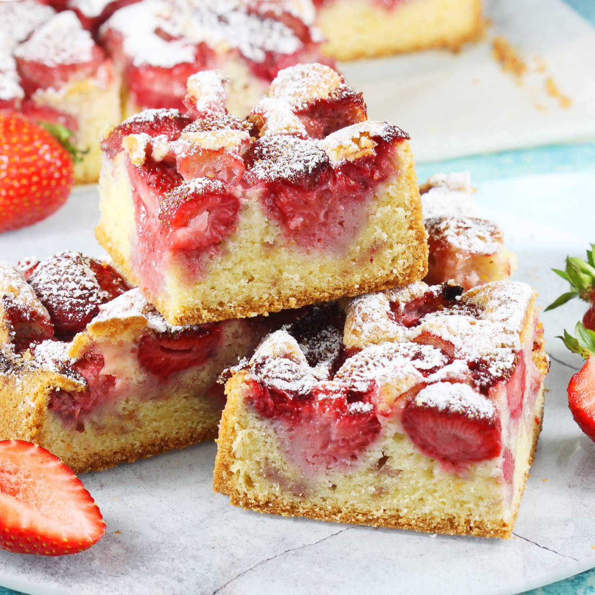

# Przepis na placek z truskawkami

Składniki (na formę ok. 22×30 cm lub tortownicę 24 cm):
 200 g miękkiego masła (lub margaryny)
 180 g cukru (ok. 3/4 szklanki)
 4 jajka
 250 g mąki pszennej (ok. 1,5 szklanki)
 1 łyżeczka proszku do pieczenia
 szczypta soli
 kilka kropel ekstraktu waniliowego (opcjonalnie)
 500 g truskawek (mogą być świeże lub mrożone – rozmrożone i odsączone)
 cukier puder do posypania (na wierzch)
 
 Wykonanie:
 Rozgrzej piekarnik do 180°C (góra–dół).
Utrzyj masło z cukrem na puszystą masę (mikserem ok. 5 minut).
Dodawaj po jednym jajku, ciągle miksując.
Dodaj ekstrakt waniliowy (opcjonalnie).
W osobnej misce wymieszaj mąkę z proszkiem do pieczenia i szczyptą soli.
Dodawaj suche składniki do masy maślanej – miksuj tylko do połączenia składników.
Przełóż ciasto do wyłożonej papierem blachy lub natłuszczonej formy.
Na wierzchu ułóż truskawki, lekko wciskając w ciasto.
Piecz ok. 40–50 minut – do tzw. suchego patyczka.
Ostudź i oprósz cukrem pudrem.
 
 Wskazówki:
 Truskawki możesz zastąpić innymi owocami: malinami, jagodami, śliwkami, jabłkami.
Jeśli masz bardzo soczyste owoce – obtocz je wcześniej w mące, żeby nie zatopiły się całkiem.

